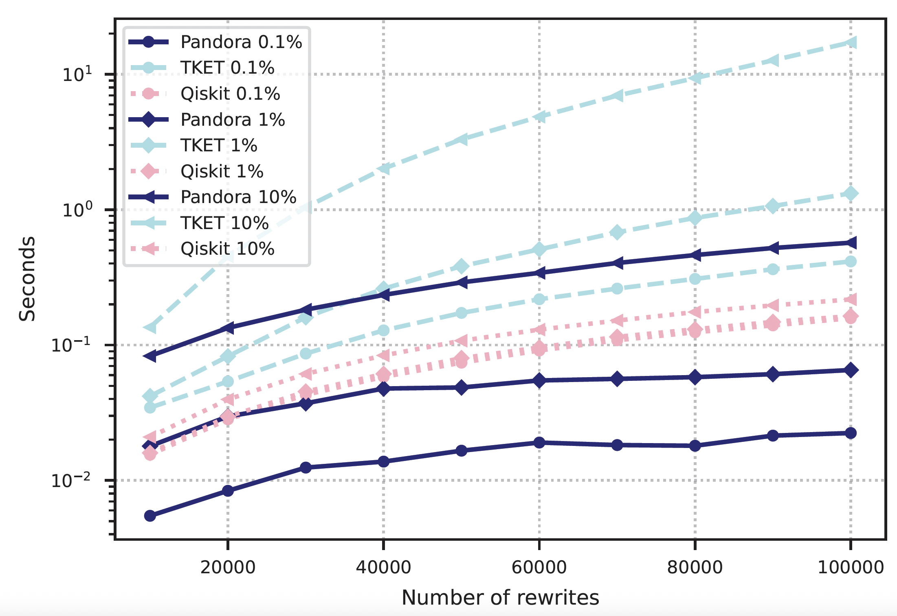
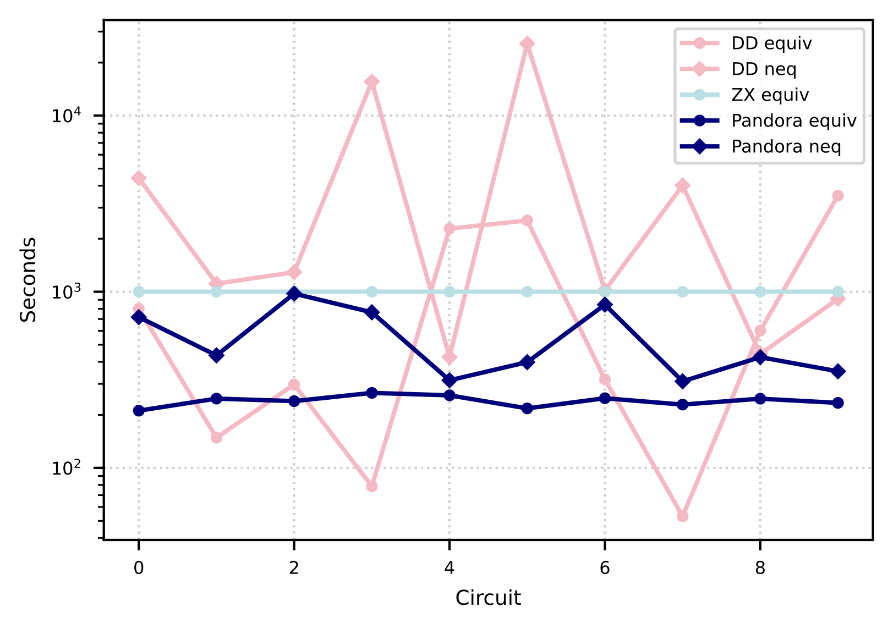

# Pandora: Ultra-Large-Scale Quantum Circuit Design Automation

## About
**[Pandora](https://arxiv.org/abs/2508.05608)** is an open-source tool for compiling, analyzing and optimizing quantum circuits through template rewrite rules. 
The tool can easily handle quantum circuits with billions of gates, and can operate in a multi-threaded manner 
offering almost linear speed-ups. Pandora can apply thousands of complex circuit rewrites per second at random circuit locations.

Pandora is HPC friendly and can be used for:
* Faster and more insightful analysis of quantum circuits
* Faster compilation for practical, fault-tolerant QC
* Faster and multi-threaded optimization for practical, fault-tolerant QC
* Fast widgetisation. A widget is a partition of the circuit which obeys some architectural constraints.

**Pandora** can take input circuits from / export to:
* <a href="https://github.com/quantumlib/Qualtran" target=_blank>Google Qualtran</a> and <a href="https://github.com/isi-usc-edu/pyLIQTR" target=_blank>pyLIQTR</a>.
* Google Cirq
* Qiskit

## Apptainer Setup
Installation instructions can be found in the `README.md` of the `apptainer` folder. In a nutshell, you need to have
Apptainer installed on your computer, a Docker image of Postgres available locally, and then to follow the 
steps from the README. At the end you will see a `pandora.sif` file in the `apptainer\images` folder. This is the
Apptainer image that will be used by `run_apptainer.sh` (see following section).

## With Apptainer 
For running on HPC hardware, this is highly encouraged. Apptainer does not require sudo rights and is also light-weight and open-source.
Multiple Pandora containers can be started in parallel, each with its own `.json` config file (make sure that the port is different). 

* A PostgreSQL config file example is `default_config.json`.
* The database storage location can be configured in `run_apptainer.sh`. As a rule of thumb, each billion of Clifford+T 
gates in the Pandora format takes about 100GB of storage.
* A command example for starting the container and decomposing an 64-bit RSA instance (nproc = 1 & container id = 0) is
```
bash run_apptainer.sh main.py default_config.json rsa 64 1 0
```
Note that for all benchmarks that do not need postgres, one can use ```run_apptainer_no_postgres.sh```.

## Without Apptainer
* Install PostgreSQL and get a server running. For example, on MacOS you can use [this tutorial](https://www.atlassian.com/data/sql/how-to-start-a-postgresql-server-on-mac-os-x).
* A PostgreSQL config file example is `default_config.json`. 
* `python3.10 main.py rsa 64 1 0` for building and decomposing an 64-bit RSA instance into Pandora.

## Widgetization
This is an example of a widgetised Fermi-Hubbard instance (N=2) decomposed into Clifford+T with around 58K gates.
Each frame is a visualisation of the widgets with d3 (each node is a gate, the color identifies the widget) for different parameters.


<a href="./vis/index.html" target=_blank>This is an example of a widgetised 2-bit adder.</a>

## Benchmarks
For details and more results, see the Pandora manuscript https://arxiv.org/abs/2508.05608.

### Single-threaded performance 
* Pandora vs. TKET or Qiskit for rewriting a specific gate pattern, when the pattern is encountered in the circuit with a certain probability (0.1%, 1% and 10%);

* the Qiskit results can be replicated running ```python3.10 /benchmarking/benchmark_qiskit.py 1```
* the TKET results can be replicated running ```python3.10 /benchmarking/benchmark_tket.py```
* the Pandora results can be replicated running ```python3.10 /benchmarking/benchmark_pandora.py default_config.json 1```

### Equivalence checking

* the Pandora results can be replicated running (0 for equivalence and 1 for non-equivalence) ```python3.10 /benchmarking/benchmark_mqt.py default_config.json 0 pandora```
* the MQT results can be replicated running (0 for equivalence and 1 for non-equivalence) ```python3.10 /benchmarking/benchmark_mqt.py default_config.json 0 mqt```

### Issues
* There is a compatibility issue between Qualtran and pyLIQTR. In order to decompose RSA, we require the latest version of Qualtran (0.6),
which is incompatible with pyLIQTR (on which we rely for Fermi-Hubbard circuit decompositions). Therefore, in order to run the Fermi-Hubbard decomposition, `requirements.txt` needs:
    ```
    qualtran==0.4
    pyLIQTR==1.3.3
    ```
  
## Citing Pandora
Please use
```
@article{moflic2025ultra,
  title={Ultra-Large-Scale Compilation and Manipulation of Quantum Circuits with Pandora},
  author={Moflic, Ioana and Paler, Alexandru},
  journal={arXiv preprint arXiv:2508.05608},
  year={2025}
}
```

## Acknowledgements
**This research was performed in part with funding from the Defense Advanced Research Projects Agency [under the Quantum Benchmarking
(QB) program under award no. HR00112230006 and HR001121S0026 contracts].**
