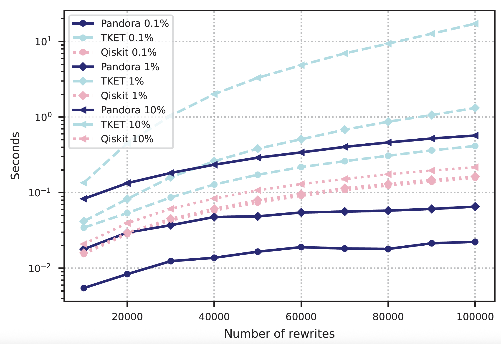
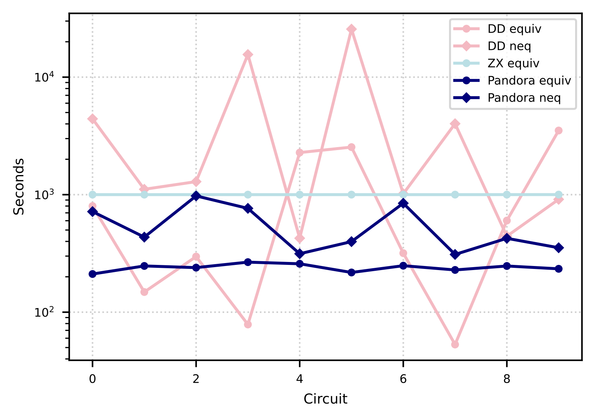

# Pandora: Ultra-Large-Scale Quantum Circuit Design Automation

## About
**[Pandora](https://arxiv.org/abs/2508.05608)** is an open-source tool for compiling, analyzing and optimizing quantum circuits through template rewrite rules. 
The tool can easily handle quantum circuits with billions of gates, and can operate in a multi-threaded manner 
offering almost linear speed-ups. Pandora can apply thousands of complex circuit rewrites per second at random circuit locations.

Pandora is HPC friendly and can be used for:
* Faster and more insightful analysis of quantum circuits
* Faster compilation for practical, fault-tolerant QC
* Faster and multi-threaded optimization for practical, fault-tolerant QC
* Fast widgetisation. A widget is a partition of the circuit which obeys some architectural constraints.

**Pandora** can take input circuits from / export to:
* <a href="https://github.com/quantumlib/Qualtran" target=_blank>Google Qualtran</a> and <a href="https://github.com/isi-usc-edu/pyLIQTR" target=_blank>pyLIQTR</a>.
* Google Cirq
* Qiskit

## Apptainer Setup
Installation instructions can be found in the `README.md` of the `apptainer` folder. In a nutshell, you need to have
Apptainer installed on your computer, a Docker image of Postgres available locally, and then to follow the 
steps from the README. At the end you will see a `pandora.sif` file in the `apptainer\images` folder. This is the
Apptainer image that will be used by `run_apptainer.sh` (see following section).

## With Apptainer 
For running on HPC hardware, this is highly encouraged. Apptainer does not require sudo rights and is also light-weight and open-source.
Multiple Pandora containers can be started in parallel, each with its own `.json` config file (make sure that the port is different). 

* A PostgreSQL config file example is `default_config.json`.
* The database storage location can be configured in `run_apptainer.sh`. As a rule of thumb, each billion of Clifford+T 
gates in the Pandora format takes about 100GB of storage.
* A command example for starting the container and decomposing an 64-bit RSA instance (nproc = 1 & container id = 0) is
```
bash run_apptainer.sh main.py default_config.json rsa 1 1 0 64
```
Note that for all benchmarks that do not need postgres, one can use ```run_apptainer_no_postgres.sh```.

## Without Apptainer
* Install PostgreSQL and get a server running. For example, on MacOS you can use [this tutorial](https://www.atlassian.com/data/sql/how-to-start-a-postgresql-server-on-mac-os-x).
* A PostgreSQL config file example is `default_config.json`. 
* `python3.10 main.py default_config.json rsa 1 1 0 64` for building and decomposing an 64-bit RSA instance into Pandora.

## Widgetization
This is an example of a widgetised Fermi-Hubbard instance (N=2) decomposed into Clifford+T with around 58K gates.
Each frame is a visualisation of the widgets with d3 (each node is a gate, the color identifies the widget) for different parameters.


<a href="./vis/index.html" target=_blank>This is an example of a widgetised 2-bit adder.</a>

## Benchmarks
For details and more results, see the Pandora manuscript https://arxiv.org/abs/2508.05608.

Examples of how to run some of the benchmarks from the manuscript can be found in the ```examples``` folder. 

### Single-threaded performance 
* Pandora vs. TKET or Qiskit for rewriting a specific gate pattern, when the pattern is encountered in the circuit with a certain probability (0.1%, 1% and 10%);

* see ```examples/speed_benchmark.md``` for instructions on replicating this benchmark

### Equivalence checking

* see ```examples/equivalence.md``` for instructions on replicating this benchmark

### Issues
* There is a compatibility issue between Qualtran and pyLIQTR. In order to decompose RSA, we require the latest version of Qualtran (0.6),
which is incompatible with pyLIQTR (on which we rely for Fermi-Hubbard circuit decompositions). Therefore, you must choose the respective mode during installation with `pip install -e '.[rsa]'` or `pip install -e '.[fh]'`.
  
## Citing Pandora
Please use
```
@article{moflic2025ultra,
  title={Ultra-Large-Scale Compilation and Manipulation of Quantum Circuits with Pandora},
  author={Moflic, Ioana and Paler, Alexandru},
  journal={arXiv preprint arXiv:2508.05608},
  year={2025}
}
```

## Acknowledgements
**This research was performed in part with funding from the Defense Advanced Research Projects Agency [under the Quantum Benchmarking
(QB) program under award no. HR00112230006 and HR001121S0026 contracts].**

## SQL code example explanation
```sql
create or replace procedure cancel_single_qubit(type_1 int, type_2 int, param_1 float, param_2 float, pass_count int, timeout int)
    language plpgsql
as
$$
    --     We are performing this rewrite:
    --
    --     First (type_1, param_2) ---- Second (type_2, param_2) ----  =  ------------

    --     LinkID (edge in the circuit DAG) has the format *IPTT where:
    --     - unlimited number of digits for the gate id I
    --     - one digit for the port P. For example, a CNOT gate has 2 ports, a Toffoli has 3 ports etc.
    --     - two digits for the gate type T. For example, a Toffoli is 23, a CNOT is 15/18 etc.
    --
    --     Considering the LinkID X, in order to:
    --     - get the gate id: X / 1000 will return the *I digits
    --     - get the port number: (X / 100) % 10 will return the P digit
    --     - get the type: X % 100 will return the T digits
declare
    -- helper variables
    first_prev_id bigint;
    second_next_id bigint;

    gate record;
    first record;
    second record;

    a record;
    b record;

	start_time timestamp;

begin
    start_time := clock_timestamp();
     -- pass_count is usually set for benchmarking purposes (we know exactly how many templates we should
     -- rewrite), otherwise it is set to a very large number
     -- we should never loop infinitely as we have a timeout set (see below)
	 while pass_count > 0 loop
   	    -- loop through all candidate gates that currently fit the pattern we are looking for:
	      -- first gate (L) with type = type_1 and parameter = param_1 having a neighbouring second gate (R)
        -- which also has the type type_2 (see *IPTT format)
        for gate in
            select * from linked_circuit
                     where
                       type = type_1
                       and param = param_1
                       and get_type_from_link(next_q1) = type_2
        loop
            -- attempt to lock the two gates
            -- if not already locked by another process (skip locked), lock the pair of gates (for update)
            select * into first from linked_circuit where id = gate.id for update skip locked;
            select * into second from linked_circuit where id = get_id_from_link(first.next_q1) for update skip locked;

            -- if acquiring locks is not successful (e.g. gates deleted already by another process),
            -- commit and move to the next candidate pair
            -- locks are released at commit!
            if first.id is null
                or second.id is null
            then
                commit;
                continue;
            end if;

            -- if gates were updated by another process during the traversal of the for loop
            -- and do not match the template pattern anymore
            -- commit and move to the next candidate pair
            if first.param != param_1
                or second.param != param_2
                or first.type != type_1
                or second.type != type_2
            then
                commit;
                continue;
            end if;

            
          if get_id_from_link(second.prev_q1) != first.id
			      or get_id_from_link(first.next_q1) != second.id
            then
                commit;
                continue;
            end if;

            -- compute the ids of the two gates (see *IPTT format)
            first_prev_id := get_id_from_link(first.prev_q1);
            second_next_id := get_id_from_link(second.next_q1);

            -- attempt to lock the neighbours of the pair (left of first gate and right of second gate)
            -- this is needed as we have to update the LinkIDs and we need to lock the neighbours pointing to
            -- the pair as well
            select * into a from linked_circuit where id = first_prev_id for update skip locked;
            select * into b from linked_circuit where id = second_next_id for update skip locked;

            -- if locking the neighbours failed, commit and move to the next candidate pair
            if a.id is null
                or b.id is null
            then
                commit;
                continue;
            end if;
            -- if we made it this far, it means we have managed to acquire all the necessary locks
            -- before deleting the single-qubit gate pair, we make sure to update the links of the neighbours

            -- we link the left neighbour of the first gate to the right neighbour of the second gate (see *IPTT format)
            if get_port_from_link(first.prev_q1) = 0 then
                update linked_circuit set next_q1 = second.next_q1 where id = first_prev_id;
            else
                update linked_circuit set next_q2 = second.next_q1 where id = first_prev_id;
            end if;
            -- we link the right neighbour of the second gate to the left neighbour of the first gate (see *IPTT format)
            if get_port_from_link(second.next_q1) = 0 then
                update linked_circuit set prev_q1 = first.prev_q1 where id = second_next_id;
            else
                update linked_circuit set prev_q2 = first.prev_q1 where id = second_next_id;
            end if;
            -- neighbouring links are updated, the only thing left to do is to delete the rows in the database
            delete from linked_circuit where id in (first.id, second.id);

            commit; -- release the locks

        end loop; -- end gate loop
        
      -- we finished a circuit pass
	    pass_count = pass_count - 1;

      -- if we exceeded the allotted time, return to avoid looping infinitely
	    if extract(epoch from (clock_timestamp() - start_time)) > timeout then
            exit;
        end if;

    end loop; -- end pass loop
end;$$;

```